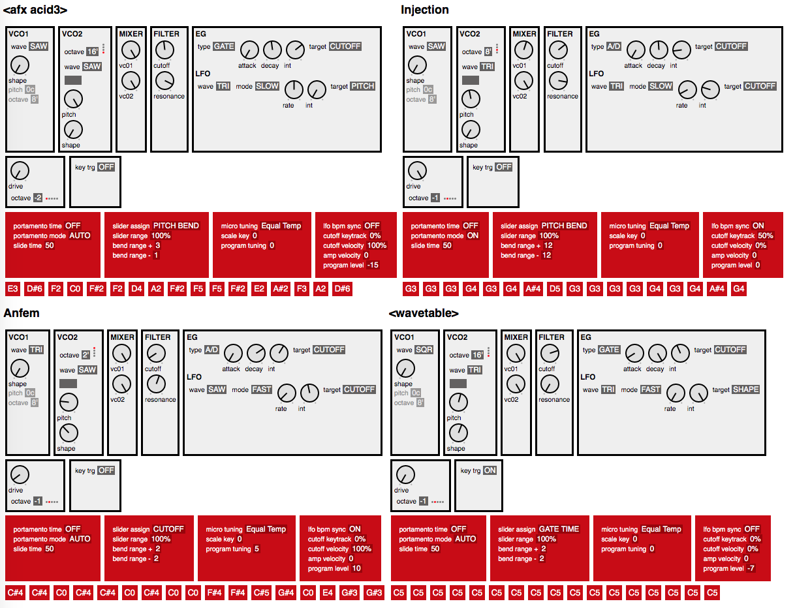

I got a Korg Monologue Synthesizer. When you loading a preset I wanted to know how it was created, i.e. what all the parameter values are. But of course, the controls are physical knobs and switches which aren't motorized, so they don't correspond to the internal values unles you move them or use the "Load Panel" function. So I wrote this little scripts to be able to visualize what the active parameters are.

By connecting the synt via midi it can be used to view the current parameters: 
```
ruby view_monologue.rb midi
```
Or the parameters of program N (0-99) currently on the synth:

```
ruby view_monologue.rb midi N
```

It can be used also with a file created with the Monologue Sound Librarian (`.molglib` or `.molgpreset`); this will show all the programs in the file:

```
ruby view_monologue.rb FILENAME
```

And this will show only program N (0-99):

```
ruby view_monologue.rb FILENAME N
```



### Notes

Currently only the program settings and the sequencer notes are shown, no ther sequencer, tuning or global parameters are decoded.

Only a few days after I got the synth and wrote this progra Korg released a new version of the firmware 2.0 (thank you!) which includes a *display original value* function that mostly fullfills my original wish from the synth interface itself, so this viewer is much less useful, but it still can be used to view all settings (or settings for multiple programs) at a glimpse.
